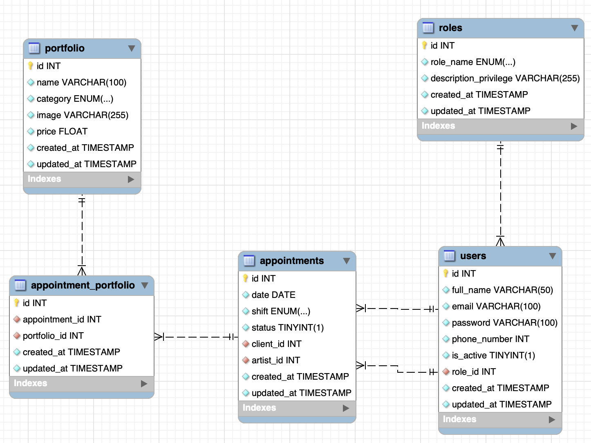
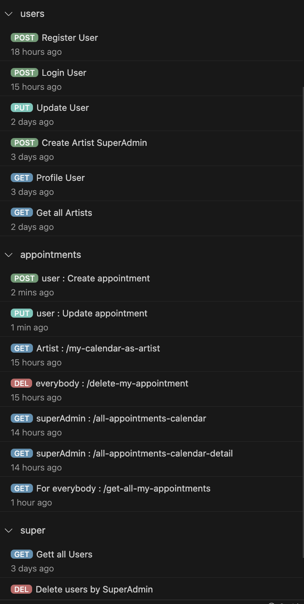

<div align="center">
<h1> ## BACKEND TATTOO & PIERCING STUDIO 🖋️ ##</h1>

**Fourth project of the Full Stack Developer Bootcamp at GeeksHubs Academy, Valencia**

<a href="https://geekshubs.com/">
        
    </a>
</div>

---

# Table of Contents

- ### 🚀 [Description](#description)
- ### 🎯 [Objective](#objective)
- ### 📉 [Database diagram](#database-diagram)
- ### 👩🏽‍💻 [Stack](#stack)
- ### ⚙️ [Local Installation Instructions](#local-installation-instructions)
- ### 📧 [Contact](#contact)
- ### 🌐 [GitHub Pages Link](#github-pages-link)

# 🚀 Description
## Appointment and User Management Project for Tattoo Studio

This project focuses on developing an API that enables clients of a tattoo studio to schedule appointments through a mobile application. It's important to note that while the interface is pending, the backend system is designed to manage appointment creation and user administration. The following outlines the key aspects of the project:

## User Management
- **User Registration**: Allows new clients to register on the platform through a public endpoint, validating the provided information.
- **User Login**: Facilitates existing users to log in with verified credentials to obtain an authentication token.
- **User Profile**: Permits authenticated users to access their personal information and profile details.
- **User Listing**: Enables superusers to access information about all registered users.
- **Profile Update**: Provides users with the ability to update their personal information.

## Appointment Management
- **Appointment Creation**: Allows authenticated clients to schedule new appointments, verifying the availability of date, time, and the artist.
- **Artist Calendar View**: Permits authenticated artists to view their scheduled appointments.
- **Appointment Deletion**: Enables users to cancel an existing appointment using a unique identifier.
- **All Appointments View**: Allows superusers to access all appointments for display in a calendar format.
- **Detailed Appointment View**: Provides a comprehensive view of all appointments, including additional information.
- **User's Appointments View**: Allows clients to view all their scheduled appointments.

The system has been designed with a clearly defined endpoint structure to carry out user and appointment management operations. While it currently lacks a graphical interface, the focus on the backend ensures a robust foundation for future implementations of a visual interface. The diagram and the list of endpoints provide a detailed overview of the functionalities and operations available in the system.

---

# 🎯 Objective

The main objective of the "Backend Tattoo & Piercing Studio" project is to provide a robust and complete backend system for managing appointments in a tattoo studio. This system aims to facilitate appointment scheduling for clients and agenda management for tattoo artists. The specific goals of the project include:

- **Developing a Robust API**: Creating a scalable and secure API that allows users (clients and tattoo artists) to interact with the appointment management system.
- **User Management**: Providing complete user management functionalities, including registration, login, profile management, and personal data updates.
- **Appointment Management**: Allowing clients to schedule, modify, and cancel appointments, and enabling tattoo artists to view their appointment schedules.
- **Modular and Scalable Design**: Building a modular and scalable structure that facilitates the future implementation of a visual interface and the expansion of new functionalities.
- **Security and Efficiency**: Ensuring data security and guaranteeing an efficient system for managing appointments and users.

###### The project aims to achieve these objectives by providing an efficient and functional backend that serves as a foundation for future iterations and improvements, with the possibility of integrating a user-friendly interface for clients and tattoo artists.

---

# 📉 Database Diagram
The following diagram represents the structure of the database used in this project for the appointment management system in the tattoo studio:


This diagram provides an overview of the relationship between the different tables in the database, showing how users, appointments, artists, and other relevant entities are connected.

---

# 👩🏽‍💻 Stack
<div align="center">
    <a href="https://www.typescriptlang.org/">
        
    </a>
    <a href="https://www.npmjs.com/">
        
    </a>
    <a href="https://jwt.io/">
        
    </a>
    <a href="https://www.npmjs.com/package/bcrypt">
        
    </a>
    <a href="https://expressjs.com/">
        
    </a>
    <a href="https://www.mysql.com/">
        
    </a>
</div>

# ⚙️ Local Installation Instructions

To install and run the project locally, follow these steps:

#### Prerequisites

- Make sure you have Node.js installed on your machine. You can download Node.js from [here](https://nodejs.org/).
- Have a MySQL database server set up either locally or remotely.

#### Installation Steps

1. **Clone the Repository**

   Clone this repository on your local machine:

   ```bash
   git clone https://github.com/ladronbx/tattoo-studio-backend-express-typeorm.git
   ```

2. **Install Dependencies**

   Navigate to the project directory and execute the following command to install the dependencies:

   ```bash
   npm install
   ```

3. **Configure the Database**

   Ensure to configure the database credentials in the respective configuration file (if required). You can find the database configuration in the `config/database.ts` file or any other file handling the configuration.

4. **Start the Server**

   To start the server, run the following command:

   ```bash
   npm start
   ```

   This command will launch the server and make the API accessible via `http://localhost:4000` (or the port you've configured).

### Dependencies Used

Here is the list of dependencies used in this project:

```bash
npm install express typescript nodemon ts-node @types/express @types/node mysql2 reflect-metadata typeorm bcrypt @types/bcrypt jsonwebtoken @types/jsonwebtoken
```

## API Endpoints for User Management

<details>
<summary><h3>1. /user/register</h3></summary>

- **Description**: Registers a new user (client) in the database.
- **Access**: Public.
- **Validations**: Verifies the provided information's validity (name, email, password, phone number) before registering the user.

    - REGISTER

        ```http
        POST http://localhost:4000/user/register
        ```
        Payload:
        ```json
        {
            "user": "newuser",
            "email": "newuser@NewUser.com",
            "password": "Password1!",
            "phone_number": 123456789
        }
        ```

</details>

<details>
<summary><h3>2. /user/login</h3></summary>

- **Description**: Logs in an existing user.
- **Access**: Public.
- **Validations**: Validates the user's credentials and issues a JWT token if the credentials are correct.
    - LOGIN

        ```http
        POST http://localhost:4000/user/login
        ```
        Payload:
        ```json
        {
            "email": "newuser@NewUser.com",
            "password": "Password1!"
        }
        ```

</details>

<details>
<summary><h3>3. /user/profile</h3></summary>

- **Description**: Retrieves data of the logged-in user.
- **Access**: Only for authenticated users.
- **Validations**: Verifies the JWT token to access the current user's profile.

    - PROFILE

        ```http
        GET http://localhost:4000/user/profile
        ```
    - Auth: `Enter the token to access the profile`

</details>

<details>
<summary><h3>4. /user/super/get/all/users</h3></summary>

- **Description**: Retrieves all users (clients) with pagination.
- **Access**: Only for superusers.
- **Validations**: Requires superuser permissions to access.
 - GET ALL USERS

    ```http
    GET http://localhost:4000/user/super/get/all/users
    ```
    - Auth: `Enter the token to access the profile`

</details>

<details>
<summary><h3>5. /user/profile/update</h3></summary>

- **Description**: Updates the data of an existing user.
- **Access**: Only for authenticated users.
- **Validations**: Verifies the updates and validates the data to be modified.

- UPDATE

    ```http
    PUT http://localhost:4000/user/profile/update
    ```
    Payload:
    ```json
    {
        "email": "newuser@NewUser.com",
        "password": "Password1!"
    }
    ```

</details>


---

## API Endpoints for Appointment Management

<details>
<summary><h3>1. /user/appointments/create</h3></summary>

- **Description**: Creates a new appointment if the date is in the future and the artist is available.
- **Access**: Only for authenticated users.
- **Validations**: Verifies the validity of the date, time slot, artist's email, and service name to create the appointment.
    
    - Create Appointment

        ```http
        POST http://localhost:4000/user/appointments/create
        ```
        Payload:
        ```json
        {
            "date": "2023-12-01",
            "shift": "morning",
            "email": "artist@example.com",
            "name": "Dragon's Eye"
        }
        ```
</details>
<details>
<summary><h3>2. /user/appointments/my-calendar-as-artist</h3></summary>

- **Description**: Displays all appointments for a specific artist (logged in as an artist).
- **Access**: Only for authenticated users with the artist role.
- **Validations**: Access to appointments related to the ID of the authenticated artist.

    - My Calendar as Artist

        ```http
        GET http://localhost:4000/user/appointments/my-calendar-as-artist
        ```
        Payload: (none)
</details>

<details>
<summary><h3>3. /user/appointments/delete-my-appointment</h3></summary>

- **Description**: Deletes an appointment by its ID.
- **Access**: Only for authenticated users.
- **Validations**: Verifies the ID of the appointment and its ownership by the authenticated user.

    - Delete Appointment

        ```http
        DELETE http://localhost:4000/user/appointments/delete-my-appointment
        ```
        Payload:
        ```json
        {
            "id": 12
        }
        ```
</details>

<details>
<summary><h3>4. /user/appointments/all-appointments-calendar</h3></summary>

- **Description**: Retrieves all appointments for agenda display (with pagination).
- **Access**: Only for superusers.
- **Validations**: Requires superuser permissions to access.

    - Get All Appointments for Agenda Display

        ```http
        GET http://localhost:4000/user/appointments/all-appointments-calendar?skip=5&page=1
        ```
        Payload: (none)
</details>

<details>
<summary><h3>5. /user/appointments/all-appointments-calendar-detail</h3></summary>

- **Description**: Retrieves all appointments in detail for agenda display (including details) with pagination.
- **Access**: Only for superusers.
- **Validations**: Requires superuser permissions to access.

    - Get All Appointments in Detail for Agenda Display

        ```http
        GET http://localhost:4000/user/appointments/all-appointments-calendar-detail?skip=5&page=1
        ```
        Payload: (none)
</details>

<details>
<summary><h3>6. /user/appointments/get-all-my-appointments</h3></summary>

- **Description**: Retrieves all appointments for a specific user (logged in as a client).
- **Access**: Only for authenticated users.
- **Validations**: Verifies the ownership of the authenticated user to the appointments.

    - Get All My Appointments

        ```http
        GET http://localhost:4000/user/appointments/get-all-my-appointments?skip=5&page=1
        ```
        Payload: (none)
</details>

<details>
<summary><h3>7. /user/appointments/update</h3></summary>

- **Description**: Updates an existing appointment if the date is in the future and the artist is available.
- **Access**: Only for authenticated users.
- **Validations**: Verifies the validity of the date, time slot, artist's email, and service name to update the appointment.

    - Update Appointment

        ```http
        PUT http://localhost:4000/user/appointments/update
        ```
        Payload:
        ```json
        {
            "date": "2023-12-01",
            "shift": "morning",
            "email": "artist@example.com",
            "name": "Dragon's Eye"
        }
        ```
</details>


<div align="center">
    
</div>


## Contributions

This project is public, and contributions are welcome. If you'd like to contribute, follow these steps:

1. Fork the repository.
2. Create a new branch for your contribution.
3. Make your changes and improvements.
4. Submit a pull request for review and merging.

---

# 📧 Contact

If you have any questions, comments, or suggestions, feel free to contact me at [ladronbravovlc@gmail.com](mailto:ladronbravovlc@gmail.com).

- ***Bienve Ladrón***  
<a href = "mailto:ladronbravovlc@gmail.com"></a>
<a href="https://github.com/ladronbx" target="_blank"></a> 

---

## 🌐 GitHub Pages Link

- 🐉 [BACKEND TATTOO & PIERCING STUDIO](https://ladronbx.github.io/tattoo-studio-backend-express-typeorm/) 🖋️

---

