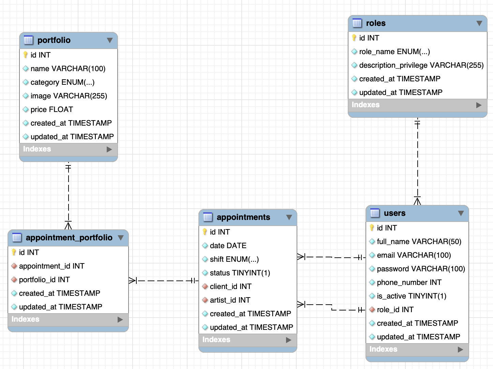
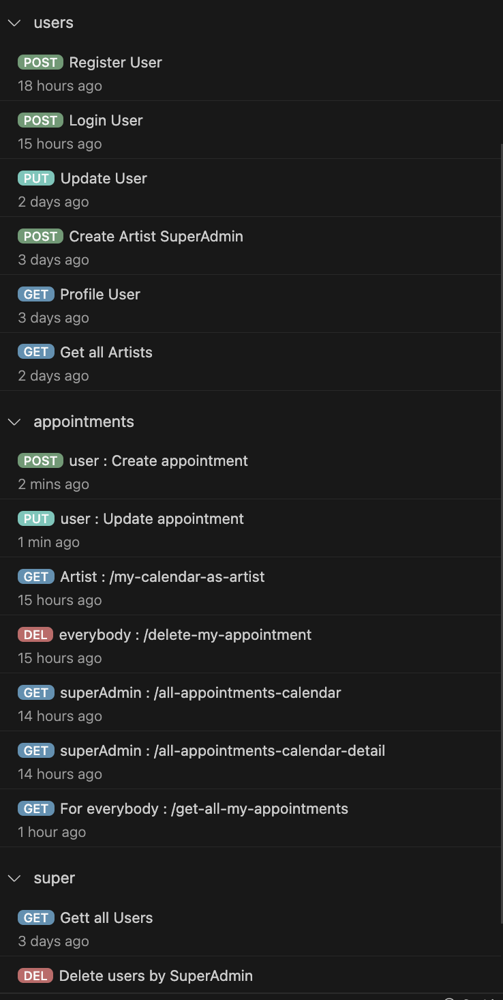

## API Endpoints for User Management

<details>
<summary><h3>1. /user/register</h3></summary>

- **Description**: Registers a new user (client) in the database.
- **Access**: Public.
- **Validations**: Verifies the provided information's validity (name, email, password, phone number) before registering the user.

    - REGISTER

        ```http
        POST http://localhost:4000/user/register
        ```
        Payload:
        ```json
        {
            "user": "newuser",
            "email": "newuser@NewUser.com",
            "password": "Password1!",
            "phone_number": 123456789
        }
        ```

</details>

<details>
<summary><h3>2. /user/login</h3></summary>

- **Description**: Logs in an existing user.
- **Access**: Public.
- **Validations**: Validates the user's credentials and issues a JWT token if the credentials are correct.
    - LOGIN

        ```http
        POST http://localhost:4000/user/login
        ```
        Payload:
        ```json
        {
            "email": "newuser@NewUser.com",
            "password": "Password1!"
        }
        ```

</details>

<details>
<summary><h3>3. /user/profile</h3></summary>

- **Description**: Retrieves data of the logged-in user.
- **Access**: Only for authenticated users.
- **Validations**: Verifies the JWT token to access the current user's profile.

    - PROFILE

        ```http
        GET http://localhost:4000/user/profile
        ```
    - Auth: `Enter the token to access the profile`

</details>

<details>
<summary><h3>4. /user/super/get/all/users</h3></summary>

- **Description**: Retrieves all users (clients) with pagination.
- **Access**: Only for superusers.
- **Validations**: Requires superuser permissions to access.
 - GET ALL USERS

    ```http
    GET http://localhost:4000/user/super/get/all/users
    ```
    - Auth: `Enter the token to access the profile`

</details>

<details>
<summary><h3>5. /user/profile/update</h3></summary>

- **Description**: Updates the data of an existing user.
- **Access**: Only for authenticated users.
- **Validations**: Verifies the updates and validates the data to be modified.

- UPDATE

    ```http
    PUT http://localhost:4000/user/profile/update
    ```
    Payload:
    ```json
    {
        "email": "newuser@NewUser.com",
        "password": "Password1!"
    }
    ```

</details>


---

## API Endpoints for Appointment Management

<details>
<summary><h3>1. /user/appointments/create</h3></summary>

- **Description**: Creates a new appointment if the date is in the future and the artist is available.
- **Access**: Only for authenticated users.
- **Validations**: Verifies the validity of the date, time slot, artist's email, and service name to create the appointment.
    
    - Create Appointment

        ```http
        POST http://localhost:4000/user/appointments/create
        ```
        Payload:
        ```json
        {
            "date": "2023-12-01",
            "shift": "morning",
            "email": "artist@example.com",
            "name": "Dragon's Eye"
        }
        ```
</details>
<details>
<summary><h3>2. /user/appointments/my-calendar-as-artist</h3></summary>

- **Description**: Displays all appointments for a specific artist (logged in as an artist).
- **Access**: Only for authenticated users with the artist role.
- **Validations**: Access to appointments related to the ID of the authenticated artist.

    - My Calendar as Artist

        ```http
        GET http://localhost:4000/user/appointments/my-calendar-as-artist
        ```
        Payload: (none)
</details>

<details>
<summary><h3>3. /user/appointments/delete-my-appointment</h3></summary>

- **Description**: Deletes an appointment by its ID.
- **Access**: Only for authenticated users.
- **Validations**: Verifies the ID of the appointment and its ownership by the authenticated user.

    - Delete Appointment

        ```http
        DELETE http://localhost:4000/user/appointments/delete-my-appointment
        ```
        Payload:
        ```json
        {
            "id": 12
        }
        ```
</details>

<details>
<summary><h3>4. /user/appointments/all-appointments-calendar</h3></summary>

- **Description**: Retrieves all appointments for agenda display (with pagination).
- **Access**: Only for superusers.
- **Validations**: Requires superuser permissions to access.

    - Get All Appointments for Agenda Display

        ```http
        GET http://localhost:4000/user/appointments/all-appointments-calendar?skip=5&page=1
        ```
        Payload: (none)
</details>

<details>
<summary><h3>5. /user/appointments/all-appointments-calendar-detail</h3></summary>

- **Description**: Retrieves all appointments in detail for agenda display (including details) with pagination.
- **Access**: Only for superusers.
- **Validations**: Requires superuser permissions to access.

    - Get All Appointments in Detail for Agenda Display

        ```http
        GET http://localhost:4000/user/appointments/all-appointments-calendar-detail?skip=5&page=1
        ```
        Payload: (none)
</details>

<details>
<summary><h3>6. /user/appointments/get-all-my-appointments</h3></summary>

- **Description**: Retrieves all appointments for a specific user (logged in as a client).
- **Access**: Only for authenticated users.
- **Validations**: Verifies the ownership of the authenticated user to the appointments.

    - Get All My Appointments

        ```http
        GET http://localhost:4000/user/appointments/get-all-my-appointments?skip=5&page=1
        ```
        Payload: (none)
</details>

<details>
<summary><h3>7. /user/appointments/update</h3></summary>

- **Description**: Updates an existing appointment if the date is in the future and the artist is available.
- **Access**: Only for authenticated users.
- **Validations**: Verifies the validity of the date, time slot, artist's email, and service name to update the appointment.

    - Update Appointment

        ```http
        PUT http://localhost:4000/user/appointments/update
        ```
        Payload:
        ```json
        {
            "date": "2023-12-01",
            "shift": "morning",
            "email": "artist@example.com",
            "name": "Dragon's Eye"
        }
        ```
</details>


<div style="text-align:center">
    
</div>
